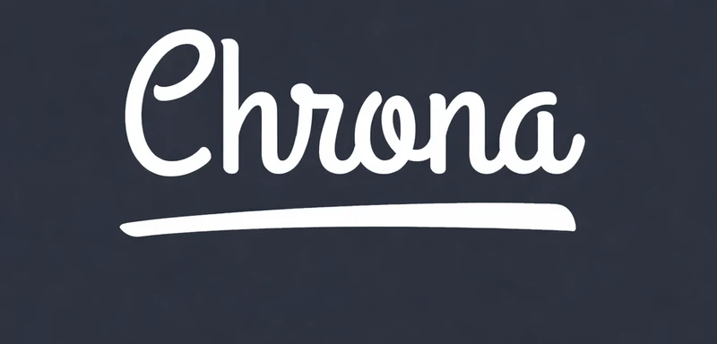
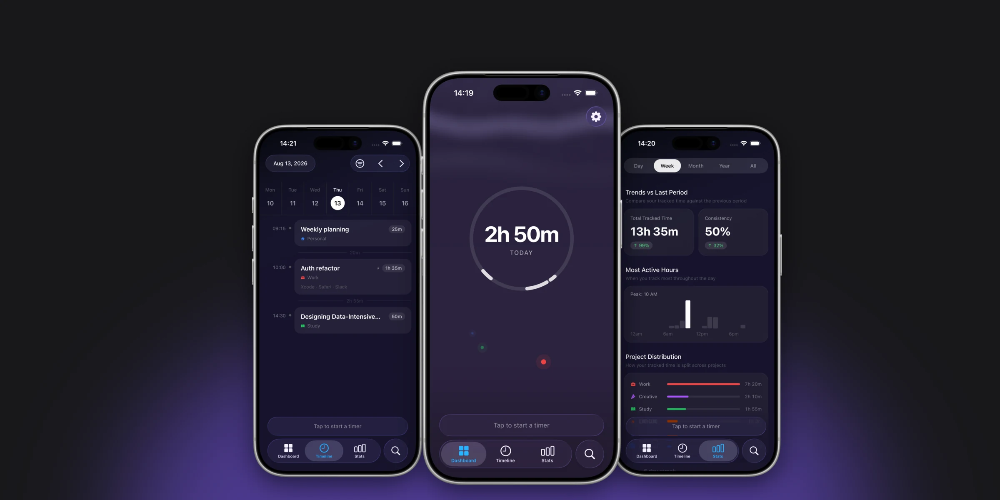
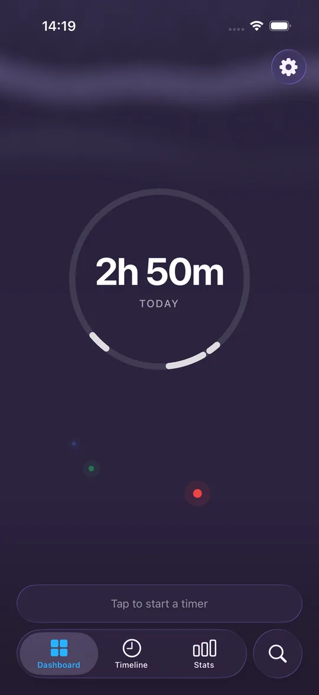
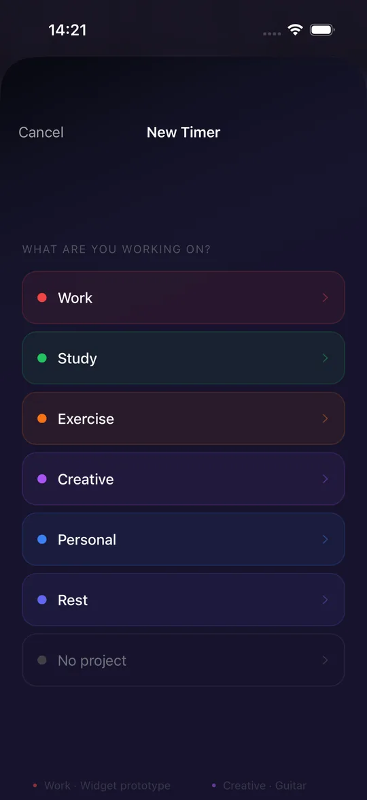
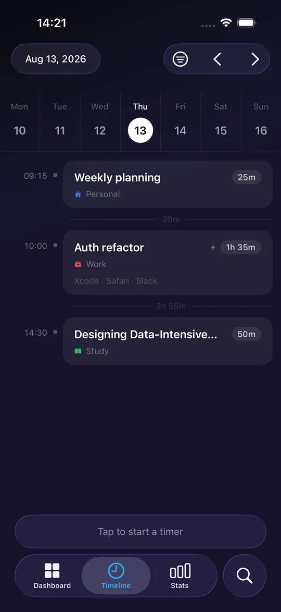
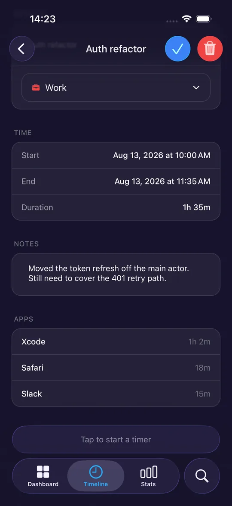
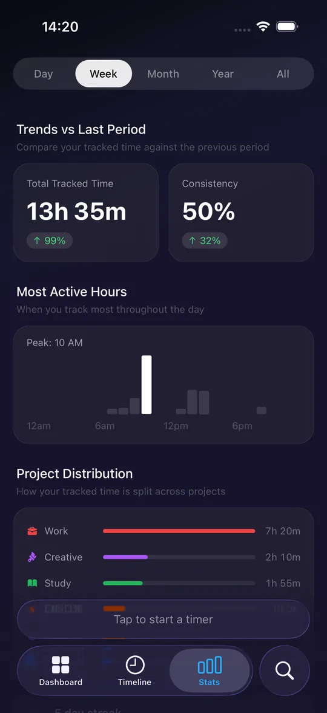
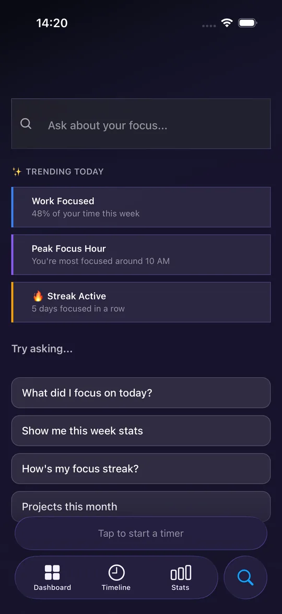
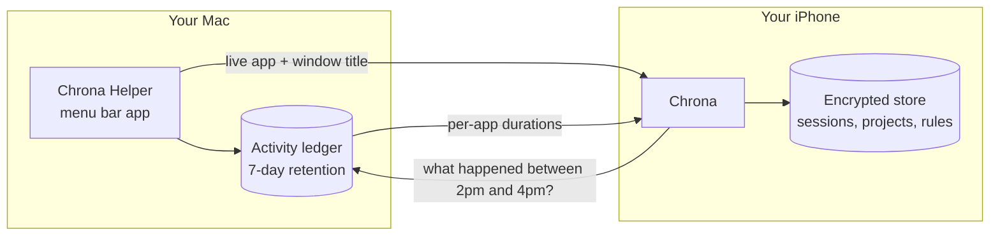

<div align="center">
  
  <p><b>A time tracker for iOS that knows what you were working on, because your Mac tells it.</b></p>
</div>

<div align="center">
  
</div>

<div align="center">

[](https://github.com/aexomir/Chrona/actions/workflows/ci.yml)


[](LICENSE)

</div>

> [!NOTE]
> Chrona isn't on the App Store and there's no download link. It's a personal project under
> active development. If you want to run it, you build it yourself — instructions below.

---

## Why another time tracker?

Most time trackers fall into one of two camps, and both have a problem.

**Manual trackers** — you press start, you press stop. Accurate when you remember. The
trouble is that you don't. You get pulled into something, work for two hours, and the
timer was never running. By the end of the week your log is fiction.

**Automatic trackers** — they watch your screen and figure it out. Accurate, but the thing
they're watching is your window titles: the documents you have open, the sites you visit,
the names of your private repos. The commercial ones sync that to a server.

Chrona does both, and keeps everything on hardware you own.

You start timers yourself when you want to commit to something. A companion app on your
Mac watches which app is in front and streams it to your phone over your local network —
so the phone can start timers for you when you open Xcode, and can tell you afterwards
that those two hours were 62 minutes of Xcode, 18 of Safari and 15 of Slack.

There is no account, no server, and no sync. Your sessions live in an encrypted store on
your phone. The record of what you did on your Mac lives on your Mac and is deleted after
seven days. The two talk directly to each other over the local network, and only after you
type a pairing code.

---

## Screenshots

<div align="center">
  
  
  
</div>

<div align="center">
  
  
  
</div>

---

## How it works



The Mac helper runs in the menu bar with no Dock icon. It notices which app is frontmost,
reads the focused window title, and does two things with that: streams it live to the
phone, and appends it to a ledger on disk.

The live stream is what makes auto-tracking possible — the phone sees you switch to Xcode
and starts a timer. The ledger is what makes the app breakdown possible — hours later,
when you stop a timer, the phone asks the Mac what happened during that window. That
answer is correct even if your phone was in your pocket the whole time, or the Mac was
asleep for part of it. If the Mac is unreachable when you save, the request is queued and
retried for up to seven days.

The connection is discovered with Bonjour (`_chrona._tcp`), so there's no IP address to
configure, and it's authenticated with a six-character code the Mac shows you once.
Details in [`ChronaHelper/README.md`](ChronaHelper/README.md).

---

## Features

| | iPhone | Mac Helper |
|---|:---:|:---:|
| Start and stop timers by hand | ✅ | – |
| Projects with colors and SF Symbol icons | ✅ | – |
| Auto-start timers from rules you write | ✅ | feeds it |
| Per-app breakdown of where a session went | ✅ | feeds it |
| Timeline with drag-to-merge | ✅ | – |
| Stats, streaks, peak hours | ✅ | – |
| Calendar events mapped to projects | ✅ | – |
| Home screen widgets and Live Activity | ✅ | – |
| Live timer shown in the menu bar | – | ✅ |
| Idle, sleep and screen-lock detection | – | ✅ |

**Timers.** Pick a project, name what you're doing, go. The bar at the bottom of every tab
shows the running session; the ring on the Dashboard shows the day's total. Stop a timer
and, if the Mac has anything to say about that window, you get a checklist of the apps
involved before it saves — deselect anything that wasn't really the work.

**Auto-tracking rules.** A rule is an app name plus optional window-title keywords, pointed
at a project. `Xcode` + `Chrona` → Work. `Safari` + `docs.expo.dev` → Study. When a rule
matches, a timer starts; when you switch away for more than fifteen seconds, it stops. Two
minutes without keyboard or mouse input on the Mac and the session is put on hold, with a
one-tap resume in the timer bar. More specific rules win over less specific ones. An app
you use for ten minutes with no rule covering it shows up as a quiet hint rather than
getting tracked behind your back.

**Timeline.** The day in order, with your calendar events drawn alongside your sessions.
Drag one session onto another to merge them. Tap any session to rename it, move it to a
different project, adjust the times, or add notes.

**Stats.** Day, week, month, year, or everything. Total tracked time with the change from
the previous period, the hours you're most active, how the time split across projects, your
consecutive-day streak, and a consistency figure. No badges, no confetti.

**Calendar.** Map a whole calendar to a project. While a mapped event is happening, the
timer bar offers to start it — one tap, title and project already filled in.

**Widgets.** A small and medium widget for today's focus time and current project, a medium
and large one for today's sessions, and a Live Activity while a timer is running.

**The background.** The Dashboard's aurora is a Skia shader that gets slowly more intense
as you accumulate focus time, topping out around ten hours. It's ambient, not a
notification. You can turn it off.

---

## Getting started

Building this takes about twenty minutes, most of which is Xcode compiling.

### What you need

- A Mac with **Xcode 15+** — both halves are built here
- An **iPhone on iOS 17+**, or just the simulator
- **[Bun](https://bun.sh)** 1.3+
- An Apple ID. The free tier works; builds signed with it expire after seven days.

### 1. Build the iOS app

```bash
git clone https://github.com/aexomir/Chrona.git
cd FoCus
bun install
cp .env.example .env
npx expo run:ios
```

The first build takes a while — it runs `pod install` and compiles the whole native
project. After that, `bun start` is enough.

Expo Go won't work. The app uses native tabs, calendar access, widgets, and a custom
native module, none of which exist in Expo Go.

### 2. Build the Mac helper

```bash
open ChronaHelper/ChronaHelper.xcodeproj
```

Set your Team under Signing & Capabilities, then ⌘R. A clock icon appears in your menu
bar. macOS will ask for two permissions:

- **Accessibility** — needed to read window titles. Without it you still get app names.
- **Local Network** — needed for the phone to find the Mac at all.

To build a distributable copy instead:

```bash
bash ChronaHelper/scripts/build.sh   # → ChronaHelper/build/ChronaHelper.dmg
```

That build is unsigned, so on any machine other than the one that built it, Gatekeeper
needs a right-click → Open the first time.

### 3. Pair them

1. Click the clock icon in your Mac's menu bar. It shows a six-character pairing code.
2. On the phone, open **Settings → Mac Helper**.
3. Type the code.

Both devices need to be on the same network. Once paired, the phone remembers the code and
reconnects on its own. Regenerating the code on the Mac disconnects every paired device.

### 4. First run

Four screens of onboarding: pick which starter projects to keep, optionally grant calendar
access, done. Everything after that is in Settings.

---

## Using it

**Start a timer.** Tap the ring on the Dashboard, or the bar at the bottom of any tab. Pick
a project, type what you're doing, start.

**Write an auto-tracking rule.** Settings → Tracking Rules → add. Put in the app's exact
name as macOS reports it, optionally some words that appear in the window title, and pick a
project. If you're not sure what an app calls itself, open something in it and check
Settings → DBG.

**Map a calendar.** Settings → Calendar → enable, then set "Track as" for each calendar you
care about.

**Read your stats.** The Stats tab. The timeframe pill at the top changes everything below
it. The trend figure compares against the equivalent previous period, not against a target.

---

## Privacy

Worth being specific, since the app reads window titles.

- **Nothing leaves your devices.** There is no account, no backend, no analytics, and no
  sync service. The only network traffic is between your phone and your Mac, over your
  local network.
- **On the phone**, sessions, projects, rules and settings are stored in MMKV encrypted
  with AES-256. The key is generated on first launch and kept in the iOS Keychain. The Mac
  pairing code lives in the Keychain too, not in the store.
- **On the Mac**, the activity ledger is a plain file at
  `~/Library/Application Support/ChronaHelper/spans.ndjson`. It keeps seven days and drops
  anything older. You can open it, and there's a menu item to reveal it in Finder.
- **The connection is authenticated.** The helper sends nothing to a client that hasn't
  presented the pairing code, so another device on your network can't discover the service
  and read your window titles.
- **Crash reporting is opt-in.** Sentry only initializes if you set
  `EXPO_PUBLIC_SENTRY_DSN` in `.env`. Leave it unset and no crash data is collected.

---

## For developers

### Stack

| Layer | Choice |
|---|---|
| Framework | Expo SDK 57, React Native 0.86, React 19.2 |
| Routing | `expo-router` with `NativeTabs` |
| Components | `heroui-native` |
| Styling | `uniwind` — Tailwind v4 via `className` |
| State | Zustand 5, persisted to encrypted MMKV |
| Animation | Reanimated 4, Gesture Handler |
| Graphics | `@shopify/react-native-skia` for the aurora shader |
| Widgets | `expo-widgets` — widgets authored in TypeScript under `widgets/` |
| Mac link | `modules/chrona-stream`, a local Expo module wrapping `NWBrowser`/`NWConnection` |
| Helper | Swift, AppKit, Network.framework |

React Compiler is on (`reactCompiler: true` in `app.json`), so don't hand-write `useMemo`
or `useCallback`.

`react-native-worklets` is pinned in both `dependencies` and `resolutions` to match what
heroui-native was compiled against. Don't bump it on its own.

### Layout

```
app/                          expo-router routes
├── _layout.tsx               Root Stack, dark theme, splash, background services
├── onboarding.tsx            Four-slide first run
├── timer.tsx                 Start / running / review-and-save modal
├── stop.tsx                  Headless deep-link target for widgets
├── settings.tsx              Settings, including the developer-mode DBG section
├── projects.tsx              Project CRUD
├── tracking-rules.tsx        Auto-tracking rules
├── calendar-settings.tsx     Calendar permission and mappings
└── (tabs)/
    ├── _layout.tsx           NativeTabs + TimerBar as BottomAccessory
    ├── index/index.tsx       Dashboard
    ├── timeline/index.tsx    Timeline
    ├── timeline/[id].tsx     Session detail
    ├── stats.tsx             Stats
    └── search.tsx            Search

features/                     One folder per domain: store, logic, components
├── analytics/                Streaks, consistency, hour buckets, stats UI
├── auto-track/               Rules, matcher, auto-tracker, untracked hints
├── aurora/                   Skia shader, intensity detection, theme hook
├── calendar/                 Calendar access, mappings, active-event suggestion
├── dev/                      Demo-data seeder (screenshots only)
├── idle/                     Reacts to the Mac's idle events
├── intelligence/             Usage queries against the Mac ledger, backfill queue
├── onboarding/               Slides
├── projects/                 Projects store
├── search/                   Keyword intent parsing and answer formatting
├── sessions/                 Session model, store, merge
├── settings/                 Four persisted preferences
├── stream/                   Mac connection state and pairing
├── timeline/                 Date helpers, rows, drag-to-merge
├── timer/                    Timer store, focus ring, timer bar
└── widgets/                  Widget and Live Activity sync

modules/chrona-stream/        Native module: Bonjour discovery, TCP, NDJSON, auth
widgets/                      Widget and Live Activity definitions (TypeScript)
ChronaHelper/                 The macOS menu bar app (Swift)
lib/                          Cross-feature Reanimated shared values
storage/                      Encrypted MMKV adapter for Zustand persist
constants/theme.ts            Colors, Semantic, TextAlpha, Neutral
```

A `features/<x>/` folder only holds what the `<x>` screen actually uses. If something is
consumed by a different tab, it belongs in that tab's folder.

### Commands

```bash
bun install
npx expo run:ios          # native build — needed after any native change
bun start                 # dev server, once a native build exists
bun run lint
bun test
bun run screenshots:ios   # Maestro capture + fastlane frameit
bun run release:ios       # bump build number, EAS build, TestFlight
```

### Conventions

- `@/` maps to the project root
- `expo-image` with `source="sf:name"` for SF Symbols — not `expo-symbols`
- `process.env.EXPO_OS`, not `Platform.OS`
- `React.use()`, not `React.useContext()`
- `ScrollView` with `contentInsetAdjustmentBehavior="automatic"`, not `SafeAreaView`
- `className` for styling — no `StyleSheet.create`

### How some of it works

**Storage.** Everything persistent goes through `storage/index.ts`, a single MMKV instance
encrypted with a key held in SecureStore. Writes are synchronous, so never wire
`onChangeText` straight to a persisted store setter — keep local state for the live value
and write on blur.

**Auto-tracking.** `features/auto-track/matcher.ts` is a pure function: given an activity
event and the rule list, return the best rule or null. App name must match exactly
(case-insensitive); every title keyword must appear in the title; rules with more keywords
outrank rules with fewer. `auto-tracker.ts` drives timers off those matches, with the
thresholds collected in `timing-config.ts`.

**The timer bar.** `features/timer/timer-bar.tsx` renders as `NativeTabs.BottomAccessory`,
so it survives tab changes. What it shows, highest priority first: an active auto-tracked
session, an active manual session, a resumable interrupted session (30-minute window), a
calendar suggestion, an untracked-app hint, and finally "Tap to start".

**App attribution.** `features/intelligence/usage-query.ts` asks the Mac's ledger what
happened in a window and gets back per-app durations plus a coverage breakdown — how much
of the window was observed, idle, locked, asleep, offline, or unknown. Those sum to the
window length, so the app can show what it doesn't know instead of implying full coverage.
When the Mac is unreachable, `pending-usage-store.ts` queues the window and retries.

**Search** is keyword matching over your own data, not a model. `query-intent.ts` looks for
substrings, `search-generation.ts` formats an answer from real session stats. It's all
synchronous and local, with no inference and no network call.

**Wire protocol** between the phone and the Mac is documented in
[`ChronaHelper/README.md`](ChronaHelper/README.md).

### Testing

Jest suites cover `stats-utils`, `timer-utils`, `timer-bar`, `focus-ring`, the auto-track
`matcher`, and calendar helpers. Maestro flows in `.maestro/` cover the new-session flow,
the stop flow, and the Mac helper status row. CI runs typecheck, lint and tests on every
pull request and on `main`.

### Screenshots

The images in this README are generated, not hand-taken:

```bash
# in the app: Settings → tap "Chrona" at the bottom five times → DBG → Seed Demo Data
bun run screenshots:ios       # Maestro captures each screen, frameit adds the bezel
bash scripts/readme-images.sh # resizes to WebP and composes the hero
```

Capture flows live in `.maestro/screenshots/`. The seeded data comes from
`features/dev/seed-demo-data.ts` and is only reachable with developer mode on. Use a
**Release** build — debug builds show expo-dev-client's floating menu button, and it ends
up in every capture.

---

## Known gaps

- **Android is untested.** The code paths exist and the project builds, but the Mac helper
  is macOS-only and nothing on Android has been exercised.
- **The Mac helper is unsigned and unnotarized.** Fine on the machine that built it,
  annoying anywhere else.
- **No sync.** Two phones means two separate sets of data.
- **The helper needs Accessibility permission**, which is a broad grant. It's the only way
  to read window titles from another process, and it's why the sandbox is off.
- **`eas.json` and `app.json` disagree** on `appleTeamId` — worth reconciling before any
  real release.

---

## Contributing

Issues and pull requests are welcome. [`CONTRIBUTING.md`](CONTRIBUTING.md) covers setup, the
conventions that matter, and how to verify a change. Version history is in
[`CHANGELOG.md`](CHANGELOG.md).

Security vulnerabilities go through
[private reporting](https://github.com/aexomir/Chrona/security/advisories/new) rather than
public issues — see [`SECURITY.md`](SECURITY.md).

Longer-form documentation lives in the
[wiki](https://github.com/aexomir/Chrona/wiki): architecture, the full wire protocol,
writing auto-tracking rules, building from source, and troubleshooting.

## License

[Apache License 2.0](LICENSE).

## Built with

[Expo](https://expo.dev) · [heroui-native](https://github.com/heroui-inc/heroui-native) ·
[uniwind](https://github.com/uniwind/uniwind) ·
[Skia](https://shopify.github.io/react-native-skia/) ·
[Reanimated](https://docs.swmansion.com/react-native-reanimated/) ·
[Zustand](https://zustand.docs.pmnd.rs/) · [Maestro](https://maestro.mobile.dev) ·
[fastlane](https://fastlane.tools)
